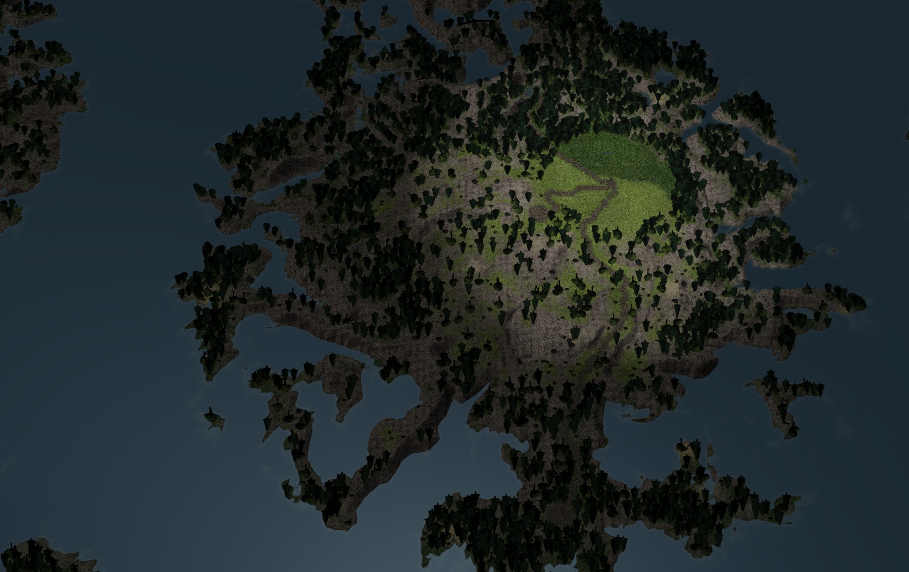
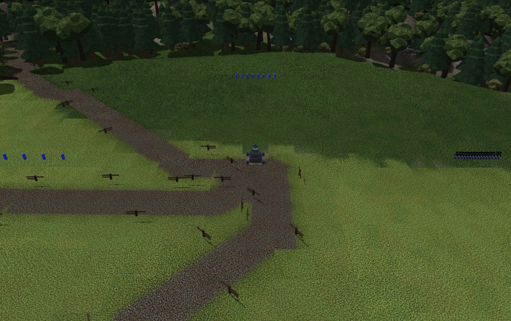

# Terrain Generation — the terragen pipeline

How Spring RTS Web maps are procedurally generated: the `tools/mapgen/terragen/`
library, the per-map generator scripts that compose it (`meridian2.py` is the
reference), what the package contains, and how the result is rendered. For the
*gameplay design* of Meridian Basin itself (regions, rows, chokepoints) see
[meridian-basin.md](meridian-basin.md); for authoring workflow around mapinfo /
regions / processing see [maps-native.md](../maps-native.md).

Goals (user directive 2026-07-27, PLAN-maps.md): large maps that are
**realistic first** — rivers/lakes, believable mountains and valleys, roads,
towns, earth-like biomes — with deterministic regeneration from a seed.
Balance/symmetry is not a requirement; gameplay contracts (slope bands, fords,
start pads) are enforced as *constraints on* realistic terrain, not by
sculpting shapes directly.

---

## 1. Why not just noise

Fractal noise (fBm/ridged) cannot produce valley structure: valleys are carved
by an *integrated global process* (water flowing downhill, accumulating, and
incising), while noise is local by construction. Pure-noise terrain reads as
"blobby". The realism in this pipeline comes from simulating that process —
**stream-power erosion over a noise-seeded base** — which produces dendritic
drainage networks, consistent watersheds, ridge spurs and valley spacing that
match how real terrain forms. Noise supplies only the initial condition and
the fine detail layer.

## 2. Library layout (`tools/mapgen/terragen/`)

Pure numpy, no GPL dependencies (`numpy`/`scipy`/`scikit-image`/`Pillow`/
`numba` in `tools/mapgen/.venv`; numba is BSD-licensed, validated against the
rejected GPL-3 alternatives — PLAN-maps.md §2b). All stages are data-in/
data-out on `(H, W)` float64 grids; no file I/O inside the library. Everything
is deterministic: seeded `PCG64` permutation tables for noise, splitmix-style
integer hashing for scatter (never Python's process-salted `hash()`), no OS
randomness anywhere. The numba `@njit` kernels (noise, `resolve_flats`,
`d8_receivers`, the LEM solve, thermal erosion) are additionally
**thread-count-independent** — every parallel (`prange`) loop writes one
output element per iteration with no cross-thread accumulation, so results
don't depend on `NUMBA_NUM_THREADS` (verified: `terragen/_selftest_numba.py`).

| Module | Contents |
|---|---|
| `noise.py` | Seeded 2D simplex noise, fBm, ridged multifractal (Musgrave weighting), billow, two-channel domain warping — fused `@njit` kernels (PLAN-maps.md §2b item 1: ~70-80× measured on fBm). |
| `hydrology.py` | Priority-flood depression filling (via `skimage` morphological reconstruction, not ported — see below), D8 steepest-descent receivers and flat resolution (both `@njit`; `resolve_flats` walks an explicit frontier queue instead of re-scanning the whole grid every BFS ring — ~100-700× measured), **level-order** flow-tree processing, flow accumulation, flow-path lengths. (Channel extraction moved to `rivers.py` — the old accumulation-threshold `river_network` produced a dotted network.) |
| `rivers.py` | **River ribbons** (§4b): slope-area channel seeding (`A·S² > C`, C solved as a quantile so a *fraction* of land seeds), downstream closure, monotone water-surface assignment, reach extraction from the flow forest, Douglas-Peucker + Chaikin + noise meandering, `w = k·√A` hydraulic geometry, and a distance-field carve combined with `min`. Returns terrain / `water_z` / `is_water` as three separate fields. |
| `erosion.py` | Fluvial erosion: the **implicit Braun & Willett (2013) stream-power solver** (`h' = (h + dt·U + F·h_recv') / (1+F)`, `F = K·A^m·dt/dx`), unconditionally stable, plus talus-angle **thermal erosion** (8-neighbour transfers) — both `@njit`. Accepts a per-cell erodibility field (lithology variation). |
| `biomes.py` | Temperature (latitude gradient + altitude lapse + noise), moisture (noise + water-proximity + **orographic rainfall sweep**, §4c), Whittaker-ish classification into 8 ids (grassland/forest/desert/tundra/snow/rock/wetland/water), soft blend weights. |
| `roads.py` | Least-cost road planning: 8-connected Dijkstra on a decimated grid with slope² cost, water/bridge penalties and max-grade cutoffs; MST topology over settlements (+ optional loops); Chaikin smoothing; full-res rasterization to mask + distance field; **cut-and-fill grading** of terrain under roads. |
| `bridges.py` | **Road water crossings** (§4d): every stretch of planned deck that runs under water, graded into chains of `ms_road_bridge` spans (centre, span count, and the road's own tangent as a Spring heading) or into refusals with reasons. Publishes into `mapdata/roads.lua`; places nothing, because no map feature format carries a spawn `y`. |
| `settle.py` | Settlement-site scoring (windowed flatness × water proximity × biome desirability × edge falloff) and greedy separated site selection. |
| `vegetation.py` | Per-species density fields (biome base × moisture bonus × clump noise, minus exclusion zones), the **climate-scoped palettes** (`palette_for(climate)` → species list + `wooded` biome set; `temperate` is `TEMPERATE_SPECIES` itself), and the **stratified-jitter hash engine** — one hashed candidate per grid stratum, accepted with probability = local density. Blue-noise-like, order-independent, deterministic. |
| `placement.py` | The **prop & ground-stamp placement subsystem** (§6): declarative `Layer`s = suitability field × sampler (`scatter`/`clusters`) × emit target (`FeatureEmit` → featureplacer entries, `StampEmit` → ground fields the bake composites). Composable suitability helpers (`biome_suitability`, `slope_window`, `below_cliffs`). |
| `dxt1.py` | Vectorized BC1/DXT1 range-fit encoder and **SMT tile clustering**: seeded minibatch k-means over 8×8 downsampled tile features, representatives chosen as *real source tiles* (never averages). |
| `smf.py` | SMF/SMT container writer (heightmap quantization, tile index, typemap/metalmap, the 9-level minimap DXT1 chain). Layout matches `rts/Server/MapProcessor.cpp` exactly. |
| `bake.py` | The albedo bake + splat textures (§5). |
| `package.py` | Map-package assembly: SMF/SMT, splat PNGs, `mapinfo.lua` emission (water, atmosphere, splat scales/mults, road `terrainTypes`, start positions), regions/feature files passthrough. |

### The level-order trick (why this is fast in pure numpy)

Downstream accumulation and the implicit erosion solve are inherently
sequential (a cell depends on its receiver). Instead of per-cell Python loops,
`hydrology.topo_levels()` groups cells by **depth in the receiver forest**:
level 0 = outlets, level *k* = cells whose receiver is in level *k−1*.
Processing levels in order guarantees every dependency is ready, and each
level is one vectorized numpy operation. Tree depth on a 2049² map is a few
thousand, so the per-level overhead is negligible. The same structure serves
accumulation (reverse order, `np.add.at` scatter) and the erosion solve
(forward order).

## 3. Pipeline stages (what a generator script composes)

```
seed + config (+ optional layout skeleton)
  1. base synthesis   structural surface + wildness-masked ridged/fBm detail
  2. erosion          N iterations of { fill → route → implicit stream-power
                      solve } + thermal talus, on the full grid
  3. contracts        re-enforce gameplay geometry (§4)
  4. hydrology        final fill/route/accumulate → river ribbons (§4b):
                      slope-area channels → centrelines → distance-field
                      carve; water surface and lakes stay OUT of the heightmap
  5. roads            settlement/waypoint endpoints → least-cost network →
                      rasterize → grade terrain under decks
  6. climate/biomes   temperature + moisture (+ rain shadow) → biome ids
  7. vegetation       per-species scatter, exclusions (roads, water, start
                      pads, corridor/choke regions) → featureplacer config
  8. self-check       E1 slope-band audit (mirrors the C++ validator)
  9. package          bake + cluster + SMF/SMT + mapinfo + splats + minimap
```

`tools/mapgen/meridian2.py` is the reference composition. Useful flags:

```
.venv/bin/python meridian2.py [--out DIR] [--seed N]
    --fast           513² grid (32 elmo/cell) — E1/preview iteration only;
                     the SMF it writes claims a 4096-elmo map, do NOT ship it
    --preview-only   skip packaging, write preview.png (hillshaded albedo)
    --with-features  emit vegetation placements (requires the map to carry
                     the tree/rock models — see §6)
```

The **eroded heightfield is cached** at
`$TMPDIR/meridian2_eroded_<seed>_<res>.npy` — erosion is the long pole
(~75 s/iter at 2049² post-numba-port, down from ~11 min for the full 30-iter
run pre-port), and contract/packaging iteration shouldn't re-pay it. Delete
the cache after changing anything upstream of stage 3 (base synthesis,
erosion parameters, seed).

Timings (M2 Pro, real layout terrain, numba-ported — PLAN-maps.md §2b item 1):
erosion per-iteration ~0.15 s @513², ~2.5 s @2049² (was ~0.4 s / ~22-40 s
pre-port — `resolve_flats` alone went from seconds-to-tens-of-seconds down to
tens of milliseconds), ~17.5 s @4097². `fill_depressions` (skimage, not
ported — reimplementing morphological reconstruction bit-exact was judged too
risky) and `topo_levels` (plain numpy, not ported) are now the dominant
remaining per-iteration cost at 4097² (~7.6 s and ~4.2 s respectively) — the
next lever if 4097² needs to get faster still. bake+cluster ~5 min,
everything else seconds. `--fast --preview-only` iterates in ~20 s.

## 4. Gameplay contracts on realistic terrain

Realism must not break the map's playability contracts. The pattern
(meridian2.py, stages 1 + 3):

- **Structural surface**: the region layout's target elevations are blended
  bbox-margin-weighted (as the original plateau generator did) but only as the
  *low-frequency* base. A per-region **wildness** multiplier scales how much
  mountain detail each region receives — ridge rows get full relief, ford
  decks/start rows stay calm.
- **Post-erosion re-enforcement**: ford decks and island pads blend back to
  their target elevations (feathered `smoothstep`); the row-D river is carved
  as a **meandering channel with a capped half-width** (so wide regions keep
  dry banks instead of becoming region-wide slabs — the basin's structural
  floor is *dry* at +16 elmos, the carved channel provides the ≤12-deep
  crossing); start pads flatten to their local median.
- **Slope-band enforcement (E1)**: regions tagged `infantry_only` /
  `heavy_restricted` must be *dominated* by their slope band (32–45° /
  24–32°). Enforced by **convergent per-region thermal erosion**: relax the
  region at a talus angle inside its band, re-measure, repeat until dominant
  (bounded attempts). This is checked twice — the generator's self-check and
  the build-blocking validator in `MapProcessor::ExtractRegions`.
- **Water**: the engine has a **single water plane at y=0** (Recoil-faithful,
  and the sim's move-depth model depends on it). Principal rivers/lakes are
  carved below 0; *elevated* stream beds render as dry gullies/wetland splat.
  Client-side "river ribbon" surfaces are a documented future divergence
  (PLAN-maps.md).

If the layout changes (`meridian_layout.json`), `mapdata/regions.lua` and
`mapdata/civilians.lua` must be regenerated with it — meridian2.py deliberately
does **not** touch them because the current skeleton is unchanged from the
original generator.

## 4b. River ribbons (`terragen/rivers.py`)

Stage 4 used to be "cells over an accumulation threshold, minus a blurred
`log1p(accum)`". That is a *raster* carve: the bed inherits every D8 zigzag as
a staircase, depth grows without width, and a confluence does nothing at all —
two tributaries meeting produced one channel exactly as deep as the deeper of
them. The replacement is the PLAN-maps.md §2b item 3 recipe:

1. **Seed by slope-area, not accumulation.** `A·S² > C`, with `C` solved as a
   quantile so a *fraction* of land cells seed (`channel_fraction`, 1.5–4.5 %
   on the shipping maps). A raw accumulation number means something different
   on every map size and every erosion budget; a fraction does not.
2. **Close the seed set downstream.** The failure mode of any bare threshold is
   a **dotted** river — one low-gradient reach drops under `C` and the channel
   vanishes for a hundred metres. Once a cell is a channel, every cell it
   drains through is one too.
3. **Assign the water surface before carving**, monotone: `w[i] = max(h[i],
   w[receiver[i]])` swept root-first. Non-increasing downstream by
   construction, never underground, and where the terrain dips below it the
   result is a lake — **which is never baked into the heightmap**. The
   depression stays in the terrain and the lake exists only as the gap between
   `terrain` and `water_z`. That is why the stage returns three separate
   fields and only `terrain` reaches the SMF.
4. **Cut the flow forest into reaches** (headwater→junction,
   junction→junction, junction/headwater→outlet). Junctions are the *last*
   point of every inflowing reach and the *first* of the one flowing out, so
   ribbons weld rather than abut; every channel edge is covered exactly once.
5. **Treat each centreline**: Douglas-Peucker (returns *indices*, so per-vertex
   width and water surface ride through unchanged), Chaikin, then a
   low-frequency noise meander of amplitude 1–2 channel widths and wavelength
   ~12, **tapered to zero at both ends** — the taper is what keeps confluences
   welded when the noise wants to move an endpoint.
6. **Width from hydraulic geometry**: `w = k·√A`. The form is chosen for its
   confluence behaviour — drainage areas add, so `w_down² = w₁² + w₂²` (the
   junction rule) is a *consequence* of the model rather than junction-specific
   code. Swap in a linear width model and confluences silently stop growing.
7. **Carve with `min`, never a lerp.** A lerp toward a bed profile *raises*
   terrain wherever the bed sits above the ground — routine on the outer bank
   of a meander running across a slope — and at a confluence it blends two beds
   into a ridge down the middle of the water. `min` is idempotent,
   order-independent and can only lower ground.

Two implementation notes that are easy to get wrong:

- **Reaches are binned by width and one EDT runs per bin, min-combined.** A
  single global `distance_transform_edt` assigns every cell to its *nearest*
  centreline, which at a confluence hands cells well inside a trunk river the
  shallow bed of the tributary that happens to be a few metres closer — a bump
  in the middle of the water.
- **Cells shared by two reaches pick a winner by width, not by write order.**
  Every junction cell belongs to three reaches; a last-writer-wins raster makes
  the finished map depend on the order of the reach list, which is not a
  property of the terrain. (This was a real defect, caught by
  `test_carve_is_order_independent_and_idempotent`.)

**`protect`** is an optional [0, 1] weight attenuating the finished cut. A
generator with a gameplay contract needs it: meridian2 pulls ford decks, the
row-D channel, the slope-band regions and the start pads to specified
elevations in stage 3, and nothing downstream re-checks them — a tributary
wandering through a start pad would silently cost that side its buildable core.
It multiplies a non-negative cut, so it cannot raise ground either.

**`channel_fraction` is not comparable between `--fast` and full res**, and both
generators carry a separate constant for each. `--fast` is 513² at 32 elmos/cell,
so the same fraction seeds against 16× fewer and 16× coarser cells, and closure
then grows the mask much further per seed: meridian reads 6.07 % channel cells at
`--fast` and 2.88 % at 2049². Do not read a `--fast` percentage as a prediction of
the shipping one.

Cost (2049², measured 2026-08-08 under 2-way contention): the whole river stage is
**4–5 s** of a ~5.5-minute generation — free next to erosion (69–78 s) and tile
clustering. 3 844 reaches on meridian, 8 452 on skerry.

Tests: `tools/mapgen/tests/test_rivers.py` (32 cases). Every metric carries a
positive control — the closure check is shown failing on the unclosed
threshold, the monotone check on the raw ground surface, the `min` rule on the
lerp it replaces, and the junction rule on a linear width model. A guard nobody
has watched fail is not a guard.

## 4c. Climate (`terragen/biomes.py`)

Biomes hang off two continuous fields, temperature and moisture. Temperature is
a latitude gradient minus an altitude lapse rate plus low-frequency noise.
Moisture is rainfall noise + a water-proximity bonus + an **orographic term**,
and it is that last one this section is about.

`ClimateParams.orographic` selects the model:

| | what it computes | windward−lee contrast, meridian / skerry |
|---|---|---|
| `"sweep"` (default) | mapgen4-style downwind advection | **+0.0700 / +0.0935** |
| `"ridge"` | running maximum along the wind axis | +0.0061 / +0.0162 |

(Mean moisture in a 512-elmo band upwind of each row's peak, minus the same
band downwind, on the real shipped heightmaps, at matched land-mean moisture.)

**The sweep.** An air parcel crosses the map along the dominant wind axis. It
tops up over open water at rate `evaporation`, and at every step rains out what
it cannot hold — capacity is `1 − normalised elevation`, and a rise in the
ground under it squeezes out more on top (orographic lift). Rain *leaves* the
parcel. That conservation is the whole point: humidity is a **budget**, so a
coastal range starves everything behind it in proportion to what it took, and a
second range behind the first has less left to wring out. On two identical
ridges in series the sweep's second shadow is **0.008×** the first; the running
max's is **0.995×**, because it has no budget — it only ever asks how far below
the highest thing upwind a cell sits, so a distant peak dries a valley as hard
as a wall does.

**Three things that are not in mapgen4's recipe, each because it was measured:**

- **The parcel enters in equilibrium with the ground, not saturated.** Entering
  at humidity 1 over a *land* edge is instant excess: on meridian_basin, whose
  upwind edge is land, column 0 alone took **25.3 %** of the map's entire
  rainfall budget. Over water it does still start saturated (skerry_reach, whose
  upwind edge is sea, read 0.0 % either way).
- **mapgen4's [0.2, 0.6, 0.2] across-wind kernel is dropped.** It exists because
  mapgen4 sweeps an irregular Voronoi mesh, where "the cell downwind" is a blend
  of neighbours by construction. On a regular grid swept along an axis it
  measured at nothing: across-wind roughness moved 0.2 % on meridian and −1.9 %
  on skerry (the wrong way), contrast <0.5 %, and on a half-width ridge it
  feathered the shadow edge by 2 rows of 96 that the post-sweep blur covers
  anyway. Rainfall's across-wind structure comes from the terrain, not from the
  parcel.
- **`rain_blur` is 100 elmos, not the 800 the old model used.** The raw rainfall
  field is streaky across the wind (16× the roughness of a 1600-elmo blur on
  meridian, 91× on skerry), so some smoothing is needed; past ~200 it smears the
  shadow back over the ridge that cast it. Measured ladder, meridian contrast:
  0.0827 (no blur) · 0.0822 (50) · **0.0699 (100)** · 0.0455 (200) · 0.0255 (400)
  · 0.0176 (800). Skerry peaks at 100 outright.

**The sweep is mean-preserving over land; the running max was not.** Rainfall
redistributes moisture, it does not destroy it, so `rain_shadow` now sets only
how much wetter the windward side is than the lee. The old model only ever
subtracted, which made it a global drying knob as well — it was quietly taking
0.032 off meridian_basin and 0.070 off skerry_reach on top of whatever
`base_moisture` said. **Both generators' `base_moisture` were re-based by
exactly those amounts when this landed** (0.45 → 0.418 and → 0.380), which holds
land-mean moisture at 0.4908/0.4909 and 0.6646/0.6665 and the biome mix within
0.4 pp and 2.3 pp. If you retune either model, re-base again or you are changing
two things at once.

**Quantile normalisation of the climate fields before thresholding (mapgen2's
approach) is deliberately NOT done.** It makes each biome band a fixed
*fraction* of the map, which is robust when the fields are raw noise — and
destructive when they are authored. `classify`'s thresholds are absolute
(hot > 0.62, cold < 0.32, frigid < 0.18) and `lat_hot`/`lat_cold`/
`altitude_lapse` are this generator's art-direction surface: meridian_basin's
temperature spans 0.000–0.635 on purpose, so it has no desert. Rank-transforming
it puts **11.9 % desert** on a temperate river basin and takes grassland from
53.2 % to 25.1 %; on skerry_reach it takes forest from 58.9 % to 27.2 % and snow
from 0.6 % to 11.7 %. A generator whose climate knobs cannot change the biome
mix has no climate knobs. (A rank transform is invariant to a constant offset,
so those two columns are identical whatever `base_moisture` says — which is the
tell: the knob genuinely stops doing anything.)

### Climate presets — map variants (`--climate`)

Both shipping generators take `--climate {temperate,arid,arctic,tropical}`. A
preset is a **shift applied on top of the map's own authored climate**, not a
replacement for it: `ClimatePreset` carries deltas (`d_temperature`,
`d_moisture`, `d_altitude_lapse`) and scales (`water_bonus_scale`,
`rain_shadow_scale`), so a map keeps its wind axis, its seed and its
`base_moisture` re-basing. `temperate` is all-zero, i.e. an exact identity —
verified by regenerating both maps' `preview.png` against a pristine HEAD
worktree and comparing sha256.

Measured land biome mix, `--fast`, archipelago / meridian2:

| preset | archipelago (skerry_reach) | meridian2 (meridian_basin) |
|---|---|---|
| `temperate` | forest 63.5 · grassland 15.3 · rock 8.5 · tundra 8.2 | grassland 50.1 · forest 19.4 · rock 17.8 · tundra 7.3 |
| `arid` | **desert 55.6** · grassland 31.9 · rock 6.0 | **desert 55.6** · grassland 25.7 · rock 14.3 |
| `arctic` | **snow 58.9** · rock 22.4 · tundra 14.6 | **snow 41.7** · tundra 30.7 · rock 24.3 |
| `tropical` | **forest 79.5** · grassland 9.7 · rock 6.4 | grassland 42.7 · forest 36.8 · rock 14.7 |

**Move the drivers, not the thresholds — and on a real map the thresholds
cannot do the job anyway.** DESERT is `hot AND dry`, and under archipelago's
temperate climate **0.0 %** of the land is hot, so no choice of the dry cut
point produces any desert at all (0.1 % at dry 0.30; at 0.50, 14.5 % of the
land is *dry* and still 0.0 % is desert). Loosening `hot` as well tops out at
**3.8 %** desert at hot 0.40 / dry 0.50 — cells whose mean temperature is
0.447, i.e. not hot — while every other biome boundary moves with them.
Moving `lat_hot` gives 55.6 %, all of it genuinely hot. The thresholds are the
shared vocabulary the splat bake, the vegetation palettes and
`placement.biome_suitability` all speak; the climate fields are the knob.

**Habitability is climate-relative, and it is not only a town table.**
`settle.settlement_score` multiplies by a per-biome desirability whose default
`SNOW: 0.0` means "nobody lives on a mountain cap" — correct when snow is 0.7 %
of the land, wrong when it is 59 %. archipelago picks its **start pads** off
the same score, so with the default table the `arctic` preset fits 3 of the 8
pads it requires and the generator exits. `settle.biome_score_for(climate)`
supplies the climate's own opinion (`arctic` → snow 0.55, tundra 0.85; `arid` →
desert 0.60) and returns `None` for `temperate`, which is the default table.
Consequence worth knowing: because pads move, the *terrain* moves with them
(pad flattening), so a climate variant is not merely a re-texture — land
fraction reads 34.5 % temperate vs 34.6 % arctic on the same seed.

Tests: `tools/mapgen/tests/test_climate.py` (27 cases). The budget test asserts
on *both* models, so it fails loudly if `"ridge"` ever stops being a contrasting
control rather than silently becoming a tautology; the preset tests pin the
identity, the drivers-not-thresholds rule, and the snowfield habitability find.

**A climate needs its own vegetation, and the palette is scoped the same way
the habitability table is.** `vegetation.TEMPERATE_SPECIES` had an opinion
about FOREST and nothing else, so the generator that scatters 17 798 features
on a temperate archipelago scattered **1 716** on an arctic one, with
`tree_broadleaf` and `deadwood` both warning *"suitability covers 0.0000 % of
the map"*. `vegetation.palette_for(climate)` returns a `ClimatePalette` —
species list plus the `wooded` biome set that stands in for FOREST in the
layers keyed off woodland rather than off a species (`deadwood`; on an arctic
map that is TUNDRA, the treeline). `temperate` returns a palette whose
`species` **is** `TEMPERATE_SPECIES`, the same identity contract
`biome_score_for` keeps.

Feature totals before → after, `--fast`, archipelago / meridian2, with the
share of the same generator's temperate total in brackets:

| preset | before | after | share of temperate |
|---|---|---|---|
| `temperate` | 17 798 / 55 662 | unchanged (identity) | 1.00 / 1.00 |
| `arctic` | 1 716 / 12 678 | **5 284 / 32 290** | 0.30 / 0.58 |
| `arid` | 4 782 / 18 042 | **7 082 / 31 809** | 0.40 / 0.57 |
| `tropical` | 21 209 / 73 177 | 20 436 / 73 315 | 1.15 / 1.32 |

The goal is not parity with temperate — a desert and an icecap are *supposed*
to be sparser — it is that no layer sits at zero and the mix is the climate's
own. **Density was only half the defect.** The `tropical` row never starved
and was still wrong: 52 % of meridian's tropical features were ridge conifers,
because FOREST is FOREST to a single table. It is now 31 338 broadleaf to
5 387 conifer at a near-identical total.

Four props exist only for these palettes — `dead_snag` (arctic + arid),
`cactus_column`, `desert_shrub` (arid), `palm` (tropical) — and they are
built from the **existing** 16-swatch atlas, so no shipped model's UVs move.
`gen_vegetation_models.py --climate <name>` writes only the props that
climate's palette references, and `package.filter_defs_lua` trims
`vegetation_defs.lua` to the same set, so a map never ships a `featureDef`
pointing at a `.gltf` its package does not contain — and `temperate` is the
original eleven models in the original order, byte for byte.

Tests: `tools/mapgen/tests/test_vegetation_palettes.py` (17 cases). The
starvation guard measures every palette against the *measured* land mixes
above, and its positive control is the old code: `TEMPERATE_SPECIES` on an
arctic mix must starve, or the guard proves nothing.

### Terrain authored as tectonics (`--terrain arc`) — built, not shipped

`archipelago.py --terrain arc` replaces the drawn island skeleton with an
**uplift rate**: en-echelon volcanic centres strung along a bowed arc
(`arc_uplift`), a trench-floor platform under it (`arc_platform`), and
`erosion.stream_power_erode_multires` run to steady state (3000 coarse
iterations at ¼ resolution, then 30 fine) so the *solver* produces the
landform rather than finishing one. The whole downstream pipeline works on
it unchanged — 8 dry start pads, roads, rivers, biomes, 17 969 features,
`mapconverter` 0 failures.

**Aim it with `uplift.scale_uplift_for_relief`, never with `Phi`.** The
`h = (U/K)·Phi` relation factorises `U/K` out of the path sum, which is
exact only for a ratio that is constant along the flow path. An uplift that
draws a landform is not: the summit-to-sea path leaves the uplifting region
within a few cells. Aiming a 950-elmo summit through `relief_scale(Phi)`
lands at **283**; aiming the same field through the path integral
`Psi = sum U_j/(K_j·sqrt(a_j))` lands within **10 %** at preview resolution
(56 % over at full res — it is a first-order aim, so read the achieved
relief back).

**No shipped map uses it, and the reason is measured.** A converged D8
stream-power landscape is *structurally periodic*: over the 32–120 elmo
band at 8 elmos/cell it concentrates **7.30×** the mean sector energy in one
orientation (angular entropy 0.9046) against the shipped `skerry_reach`
surface's **1.24× / 0.9989** — straight parallel spurs where the shipped map
has dendritic valleys, plainly visible in matched hillshade crops. Nothing
in reach moves it: coarse iterations 100→3000 (5.07→3.95), fine iterations
30→300 (3.95→4.04), coarse factor 4→2 (3.95→3.75), single-resolution
instead of multires (3.39), 120 elmos of isotropic noise on the starting
platform (3.05), and an arc heading of 18° instead of 45° (4.51) — against
the shipped arm's 1.47 at that resolution. The shipped generators escape it
because their fine structure is **authored noise that erosion only
finishes**; a solver asked to build a network from nothing builds it on the
lattice. The unblocking item is a multiple-flow-direction router (D∞/MFD)
in `hydrology.py`, which every generator and both shipped maps depend on.

⚠ **Judge this with `uplift.structural_anisotropy`, not with a gradient-
aspect histogram.** Aspect reads +0.048 lattice-direction excess for the
shipped map and +0.059 for the herringbone — it cannot tell them apart.
Same trap as PLAN-maps M8m's flow-direction entropy (0.975 vs 0.978), which
is why that milestone recorded the combing as "the LEM's real answer" rather
than a lattice artifact. And the reading has a sample-count floor (2.35 /
1.84 / 1.68 at 257 / 513 / 1025 cells for one isotropic fBm), so only
compare surfaces at the same grid size — which is also why `--fast` is not
even a *look* at an arc map: its coarse LEM grid is 4× coarser in elmos.

## 4d. Road water crossings (`terragen/bridges.py`)

The road planner PRICES water (`RoadParams.water_penalty`) rather than
forbidding it, so a generated network fords its rivers and inlets. Those fords
are the only places on a map where a bridge span means anything, and R3b makes
them a published fact rather than something a later stage has to guess at:
`find_crossings` walks the delivered surface under every link and grades each
wet stretch, `emit_roads_lua` writes the survivors into `mapdata/roads.lua`,
and `scenariogen` prefers them over its own blind narrowest-gap search
(`find_crossing`, which had no idea where the roads were).

What is graded, and why each rule is a rule:

* **fordable** — `max_depth <= 20` (VEH's wade depth from `moveinfo.tdf`). The
  span is non-blocking decoration, so the ford UNDER it is what units actually
  cross; a wet stretch deeper than that is a broken ROUTE and is reported as
  one, not decorated over.
* **3..24 spans**, sized by `floor(chord / pitch)` over the water. One segment
  is a plank over a ditch; past 24 the gap is open water and the chain is a
  landfill.
* **every span centre over water**, asked of the same centred arithmetic
  `game_scenario.lua`'s `stageFeatures` uses. This is what refuses a crossing
  that bends inside the water: the chain is straight even when the road is not.
* **heading = the road's tangent**, in Spring heading units (0 = FACING_NORTH,
  direction `(sin t, -cos t)` = the model's local -Z). The blind search could
  only offer a cardinal.

**The map does not place the spans, and cannot.** A featureplacer objectlist
entry has no `y`, and `CFeatureHandler::LoadFeaturesFromMap` spawns at
`CGround::GetHeightReal` — so a map-authored chain lies on the riverbed
(§M3 measured -31.0 / -34.5 / -45.9 / -57.6 for four spans laid without a
spawn height). `stageFeatures` takes an explicit `y`, and a chain staged at
`y = 0` over water holds level because `floating = true` zeroes gravity there.
So the scenario stages, the map publishes.

**A span is decoration and v1 says so.** `features/bridges.lua` ships
`blocking = false` because Spring pathing is single-layer and a blocking span
is a wall across the gap it exists to open; units wade the ford under the deck
rather than driving on it. When the `deckHeight` engine ask lands
(`.tasks/notes/model-integration.md`), these crossings are already the right
places to raise.

Measured on the shipped generators (`--fast`): skerry_reach has 4 wet
stretches, 2 bridgeable (11 spans) and 2 refused — a 56-elmo ditch and a
992-elmo, 11.4-deep inland channel that is 37 spans wide. meridian_basin has
none: its authored ford decks sit at -6 but the planner does not route a deck
through them.

Tests: `tools/mapgen/tests/test_bridges.py` (25 cases). The heading convention
is pinned against `game_scenario.lua` itself, and the pitch against
`features/bridges.lua`'s `customparams.chain_pitch`.

## 4e. Roadside yards (`tools/mapgen/road_frontage.py`, roads R4)

The other half of the published road graph. R2's `links` block exists so a
later stage can plug into a real road instead of guessing where one is; R3b
spent the `crossings` half of that file, and this spends the `links` half.

**A yard is a relation to a ROAD, and nothing else in the scenario layer has
one.** Every other placer in `scenariogen` is anchored to a REGION — a ring
search outward from the region anchor, terrain-checked, dodging what is already
there — and that relation puts a supply depot in the middle of a field. R4 adds
one placer whose anchor is a link: a building set back from the carriageway,
its apron between it and the road, and vehicles parked on the apron.

* **The parcel is a `town_planner.Lot`**, carved off the link the way
  `_carve_lots` slices a street. That keeps ONE frontage convention in the
  tree — the frame, the box projection and the cardinal all come from
  `town_stager`, not from a second derivation of the same geometry.
* **`_yard_anchor` is `town_stager._anchor_for` with the sign flipped.** A town
  house fronts the street and its yard falls behind it; a depot's yard is
  between it and the road, because that is where the lorries stand. Nothing but
  a measurement distinguishes the two, so `tests/test_road_frontage.py`
  measures it on both sides of the road.
* **`classes` is the requirement, and it refuses rather than relaxes.** R2
  planned a hierarchy (highway 0 / road 1 / track 2) precisely so a consumer
  could ask for a road of a given standard; a fuel stop asks for a highway and
  is ABSENT, by name, from a map that has none.
* **Nothing is built on the deck.** A building blocks, so a yard on the
  carriageway severs the route the road exists to provide and does it silently.
  `_clears_deck` gates the shed and every parked vehicle against the published
  polyline (not against the parcel's local frame — a link bends), and the yards
  then go through `gate_blocking_features_leave_the_war_fightable` alongside
  the wreck field, because "off the deck" is local and "the armies can still
  reach each other" is global.
* **The parked vehicles are ordinary Gaia units.** `ms_civtruck`/`ms_civbus`
  carry `customparams.civilian = '1'`, so `estate.registerBuilding` files them
  at `UnitCreated` with role **`estate`** — which is what keeps them parked:
  `routines.tick()` wanders and flees only the `ambient` ones.

**What is NOT here, and why it is not a missing feature.** The brief also asks
for driveway/parking splat markings and a standalone lot with no building. Both
are baked-at-generation-time work and this is a scenario-time placer: the splat
distribution, the albedo and the typemap are all final before `scenariogen`
ever reads the map, which is the same seam `emit_roads_lua`'s header describes
(a town discovered afterwards cannot move a road). A lot with no building also
has no footprint to anchor or to own its clearance. Both want a terragen-side
layer that plans yards at generation time from the same link graph.

Tests: `tools/mapgen/tests/test_road_frontage.py` (13 cases), including the
`mapdata/roads.lua` `links` round trip — the reader dropped the final vertex of
every polyline on its first cut, which read as a map whose roads were simply
not there.

## 5. Texturing model

Two layers, matching what Spring/Recoil (and SupCom/Frostbite/Unity) converge
on — see the research record in PLAN-maps.md §1.2:

1. **Baked whole-map albedo at 1 texel/elmo** in the SMT tile layer.
   *Unlit* — material colour only (biome palettes + macro/mid tonal noise,
   slope rock exposure, ground stamps (§6), wetness/shore darkening, riverbed
   tint by depth, sharp road decks with worn shoulders). Relief shading comes
   from the real-time sun + full-resolution mesh normals + CSM, and an unlit
   bake also clusters far better: `dxt1.cluster_tiles` vector-quantizes the
   262,144 tiles of a 16k map to a ~12k-tile budget (~8 MB SMT instead of
   ~178 MB). The SMT format *is* a deduplicated megatexture — but Spring's
   own compiler dedupes tiles **exactly**, and this quantizer does not, which
   is a recorded deviation with a measured cost: it flattens tile interiors
   and dumps the difference onto the 32-elmo grid, so the seam jump reads
   ~15× the interior gradient where a continuous field reads ~1. Raising the
   budget does not fix it (error falls as `budget^(-1/9)`); the fix is
   architectural. `eval_ground_albedo.py` (§7) is how a replacement is
   argued, and PLAN-maps.md M7 item 1 carries the options.

   Two hard-won rules keep the bake artefact-free:
   - **The bake stays low-frequency** (nothing under ~50-elmo wavelength).
     Tile dedup collapses uniform areas onto a handful of representative
     tiles, so any baked per-texel grain becomes the *same* 32-elmo noise
     pattern repeating with visible grid seams. Per-texel grain is the
     runtime splat layer's job.
   - **Biome colours blend through smoothed weight fields sampled via a
     fractally warped domain** (per-biome Gaussian one-hots, ±22-elmo warp
     at two scales, noise-perturbed in the mixed zone, then sharpened and
     renormalized). Nearest-id lookup at heightmap res produces 8-elmo
     axis-aligned staircases at every biome edge; the warped blend gives
     irregular, patchy transitions (snow↔rock, grass↔forest) instead.
2. **Recoil's signed splat detail** up close: `splat_distr.png` (RGBA layer
   weights from biomes/slope + ground stamps) + `splat_detail.png` (4 tileable
   greyscale layers: grass/rock/sand/snow, procedurally synthesized). The
   client's `TerrainSplatPlugin` implements the exact SMF shader formula —
   `detail = dot(2·tex−1, distr·texMults)` **added before lighting** — so the
   signed detail self-fades through the mip chain with no distance threshold.
   Per-channel `texScales` at widely different rates provide multi-scale
   anti-tiling for free.

   Detail-texture synthesis rules: the seamless-tiling wrapper's 4-corner
   blend weights must come from the **raw** tile coordinates — domain offsets
   and anisotropic frequencies apply inside the noise sample only (offset
   blend coords extrapolate instead of blending and render as structured
   banding repeating at the texscale period). Directional components (the
   sand ripple) use an integer number of cycles per tile. Every channel is
   **zero-meaned** before encoding, so the mip-faded far field carries no
   brightness offset relative to the near field.

The minimap *does* bake hillshade (legibility beats physical correctness on a
2D map). `typemap` value 1 marks road surfaces; `mapinfo.lua` `terrainTypes`
gives them a speed multiplier.

## 6. Placement (vegetation, boulders, ground stamps)

`terragen/placement.py` is the placement subsystem: everything the generator
drops onto the finished heightfield goes through one declarative model.

A **`Layer`** is one placement rule:

- **WHERE** — a `suitability(ctx) -> (H,W) [0,1]` field, composed from
  helpers (`biome_suitability`, `slope_window`, `below_cliffs`, `combine`)
  or any custom closure over the `PlacementContext`
  (height/slope/biomes/moisture/exclusion).
- **HOW** — a sampler: `scatter` (stratified-jitter blue noise, one hashed
  candidate per stratum cell), `clusters` (sparse hashed seeds accepted by
  suitability, then a hashed ring of members — talus fans, boulder fields),
  or `along_paths` (stations along `ctx.paths` polylines — the road network
  today, rail later — with hashed dropout, lateral offset, and rotation set
  to the local path heading: fences, roadside debris, sleepers, poles).
  `TemplateEmit` turns any sampler's placements into composed *sites*: a
  template of (name, dx, dz, keep) elements rotated by the site's hashed
  rotation with per-element jitter and dropout — ruin colonnades lose
  different pillars at every site; dwelling compounds use the same shape.
- **WHAT** — an emit target: `FeatureEmit` (weighted feature-def names →
  featureplacer `objectlist` entries, i.e. real sim features) or `StampEmit`
  (soft smoothstep discs rasterized into named grid-res fields — **baked
  decals**: `bake.py` composites them into the albedo with warped ragged
  edges, and `make_splat_distr` routes each stamp to its detail channel via
  `STAMP_STYLE`, so scree gets rock granulation and sand gets ripple grain
  at zero runtime cost).

All randomness is `_hash01` integer hashing keyed on `(seed, layer name)` —
fully deterministic, no RNG order dependence. Future placement families
(wreckage, dwellings, rail lines, bridges) are new layers/targets on this
model, not new mechanisms.

Meridian's layer set: the `vegetation.palette_for(climate).species` scatter
layers (species density fields become layer suitabilities — four on the
temperate palette, up to seven on `arid`), `boulder_field` clusters
(`rock_boulder_large` + `rock_boulder` mixed, favouring rocky biomes and the
scree aprons), `erratic` lone outcrops, `deadwood` (fallen logs + stumps in
the `forest_edge` band of the **palette's** `wooded` biomes, sparse inside —
hard-coding FOREST there starved the layer to zero on an arctic map, whose
trees are a tundra treeline), `road_fences` (broken split-rail
segments along the road polylines), `ruin_colonnade` template sites (7-pillar
ring + 3 wall fragments + optional centre monolith, on flat open ground
within sight of a road), `ridge_stones` (lone monoliths on high ground),
`talus_scree` stamps below cliffs (>34° dilated), and `sand_flats` stamps
(desert + low flat shores). Roads additionally get **junction plazas**
(`roads.carve_plazas`): circular worn decks merged into the road distance
field at district centres and convoy waypoints, so grading and the bake
treat them exactly like the ways that meet them. All models are
**procedurally forged** (`tools/mapgen/gen_vegetation_models.py` → glTF +
KTX2 into the map's `objects3d/`, deterministic, licence-free), with 8-yaw ×
3-pitch impostor atlases baked by `tools/fable-model-forge/bake_impostors.py`.

> **Sourcing divergence (deliberate, recorded per AGENTS.md).** PLAN-maps.md
> §1.4 originally called for **CC0 third-party** tree/rock models run through
> the model pipeline. The props are generated instead. Two reasons: the forge
> style bible (flat-shaded low poly, palette-atlas UVs, elmo-authored) is what
> every Metalstorm unit is built to, and CC0 nature scans/packs would read as a
> different game next to them; and generation keeps the whole map package
> deterministic and free of per-asset licence bookkeeping (no `ASSETS.md` rows,
> no redistribution terms). PLAN-metalstorm-beta-units.md sanctions the
> generated-model route alongside CC0 sourcing, so this is a choice between two
> approved options — not a stand-in. Swapping in CC0 sources later needs no code
> change: they just have to land in `objects3d/` as glTF with a baked atlas.

Exclusion zones (roads, water, start pads, `corridor`/`choke` regions) gate
feature layers so chokepoints stay passable; stamps ignore them (the road
deck is painted over stamps in the bake). Trees and boulders are `blocking`;
scrub is not. Per-placement scale is recorded but the Spring featureplacer
format doesn't carry it — size variety comes from multiple feature defs
(`rock_boulder` vs `rock_boulder_large`).

Rendering: `feature-lod-renderer.ts` splits each species into 2048-elmo tiles
with three tiers — full mesh, impostor card, culled (beyond `cullDistance`,
and at whole-map camera height, where the albedo bake carries the forest
read). Vegetation casts CSM shadows only within `shadowDistance` (1200 elmos)
— Babylon submits every caster to every cascade, so ungated casting cost
~18 ms/frame at close zoom on the 56k-feature Meridian.

The mesh→card distance is **per species**, published in the package-wide
`objects3d/impostors.json` that `bake_impostors.write_manifest()` folds out of
the per-model sidecars (FeatureProcessor ships it into the processed
`features/` dir; the client reads it in one request instead of probing per type).
Each species' distance is sized so every prop reaches its card at the same
**on-screen size** (70 px against a 128 px atlas cell, i.e. still oversampled
at the swap): a 137-elmo conifer swaps at 2505 elmos — the global default it
replaces, so forest behaviour is unchanged — while a 19-elmo fence post swaps
at 361 instead of staying a full mesh 7× too far out. The tier dead band scales
with the threshold (15%, capped by the global `hysteresis`) so a 52-elmo band
protects a 350-elmo swap rather than a 256-elmo one swamping it.

## 7. Processing & verification loop

```
# regenerate (full res, with vegetation)
cd tools/mapgen && .venv/bin/python meridian2.py --with-features

# process into data/maps (build-blocking E1 validation runs here).
# Regenerated sources are auto-detected: processing writes a
# .processed-stamp, and any source file newer than it triggers a reprocess —
# --force is only needed to rebuild an UNCHANGED map (e.g. after C++
# processing changes).
build/release/tools/mapconverter/mapconverter content/maps/meridian_basin

# then: RESTART THE LOBBY (its maps-table handle goes stale after the
# converter writes the DB — symptoms: /api/maps returns [], metadata.json
# 404s, blank canvas behind the HUD), restart the Vite client if worker code
# changed, create a room on the map in the browser, and eyeball at
# strategic/gameplay/close zoom (docs/debugging.md + the run-springrts-web
# skill for the drive recipe)
```

The self-check output (`E1 <region> expected=… dominant=…`) must be all-OK
before processing; the C++ validator rejects the map otherwise.

### Determinism (`--selftest`)

`same inputs ⇒ byte-identical map` is a contract, so every shipping generator
proves it on demand:

```
cd tools/mapgen
.venv/bin/python meridian2.py   --selftest [--fast] [--with-features]
.venv/bin/python archipelago.py --selftest [--fast] [--seed N --landmass F --islands N]
```

The flag runs the generator **twice as independent cold subprocesses** and
hashes every file in both packages (`terragen/selftest.py`). Two details are
what make the result mean anything, and both are easy to lose:

- **Each run gets its own `TMPDIR`.** Both generators cache the eroded
  heightmap at `$TMPDIR/<gen>_eroded_<key>.npy`; without isolation, run 2
  loads run 1's array and the longest, most numerically sensitive stage in
  the pipeline is never exercised. The check would then pass regardless of
  how nondeterministic erosion is.
- **The isolation is itself verified.** If a run writes no matching cache
  inside its scratch dir, the generator has stopped honouring `TMPDIR` and
  the harness reports a *failure* rather than the pass it did not earn.

`--fast` is the practical loop (a couple of minutes); the full-res run is the
shipping gate. `--preview-only`/`--no-package` are rejected — they skip
packaging, which is most of what there is to compare. `gen_vegetation_models.py
--selftest` covers the prop models separately (11 species), and
`terragen/_selftest_numba.py` covers thread-count independence of the `@njit`
kernels. Harness tests: `tools/mapgen/tests/test_selftest.py`.

### Ground-albedo delivery (`eval_ground_albedo.py`)

The tile dictionary is *lossy* (see §5 and the `FIDELITY-STANDIN` on
`dxt1.cluster_tiles`), and every proposed replacement for it has to be argued
against the unquantized bake rather than against the shipped map. A full
generator run leaves that ground truth at `$TMPDIR/<map_id>_tiles.npy`
(805 MB for a 16k map), so the comparison needs no browser:

```
cd tools/mapgen
.venv/bin/python eval_ground_albedo.py $TMPDIR/skerry_reach_tiles.npy \
    --seed 20260730 --crops 432,400,16 --crop-dir /tmp/albedo
```

It carries both paths all the way to what the GPU samples — the tile
dictionary (cluster → DXT1 → decode) and a low-resolution map-space albedo
(box-downsample → DXT1 → decode → bilinear upsample) — and reports, for each,
the reconstruction error against the source and the seam metric
`dxt1.seam_discontinuity` uses, on **both** axes rather than x alone.

Two traps it is built around, both of which produced a plausible-looking wrong
answer first:

- **The codec has to be in the comparison.** The two paths do not have the
  same number of texels per DXT1 block, so leaving compression out flatters
  whichever one is coarser.
- **A crop is evidence, so it must be the same pixels the metrics came from.**
  Slicing the horizontally-expanded field with low-res column indices renders
  a different part of the map entirely — and it looks perfectly plausible,
  because a wrong window of a terrain albedo is still a terrain albedo. Guard:
  `test_crop_window_matches_the_full_map_reconstruction`. The crops are also
  written with a 1–99 % contrast stretch, since the defect being judged is a
  ~3-level checkerboard on a field whose whole range is ~60 levels.

Harness tests: `tools/mapgen/tests/test_ground_albedo_eval.py` (15), each
metric with a positive control; a nearest-neighbour (blocky) upsample is
checked to fail them.

## 8. Adding a new map

Two shipped generator styles to copy from:

- **Layout-driven** (`meridian2.py`): a hand-authored region skeleton with
  gameplay contracts re-enforced after erosion. Copy it when the map's
  strategic layout is designed first (regions.lua + E1 validation).
- **Free-form parameterized** (`archipelago.py` → Skerry Reach): everything
  derived from CLI parameters — `--seed`, `--landmass` (fraction of area
  above the waterline, enforced by quantile calibration before AND after
  erosion), `--islands`. Same parameters ⇒ byte-identical map (verified by
  `--selftest`, §7). Island centres via deterministic
  dart-throwing; starts round-robin across the largest islands via
  `settle` scoring (its own contract: 8 dry, separated, flattened pads);
  per-island road networks (roads never island-hop); the full placement
  layer set (§6) including `tools/mapgen/vegetation_defs.lua`, the shared
  prop-def file generated maps install as `features/vegetation.lua`.

Recipe:
1. Copy the closer generator; replace the surface-synthesis section. Pick a
   `bio.ClimateParams` (an ice or desert map is a parameter set: `lat_hot`,
   `altitude_lapse`, `base_moisture`, `wind_dir`, plus species tables) — or,
   if the terrain you want already exists, skip the copy entirely and take a
   **climate variant** of an existing generator: `--climate arctic --id
   frost_reach --name "Frost Reach"` is a whole different-looking map from
   the same synthesis code (§4c).
2. Add `mapdata/regions.lua` + the E1 self-check if the game uses the
   region system; free-form maps assert their own generated contracts
   (land fraction, dry starts) instead.
3. Iterate: `--fast --preview-only` for composition (30-60 s),
   `--no-package` for placement-layer tuning (~70 s full-res with cached
   erosion — watch the per-layer `suit %` coverage in the output), then
   full-res, `gen_vegetation_models.py --out <map dir>`, mapconverter,
   in-game pass. If you change the synthesis code, bump the generator's
   `SYNTH_REV` so the erosion cache re-keys.

## 9. Goldens

Reference captures of the two shipped generated maps (regenerate after visual
changes and eyeball against these):





### Measured LOD cost (2026-08-03, this machine, retina)

Submitted (post-frustum-cull) feature vertices, `__featureLod.force('near')`
versus the automatic tier assignment, at a fixed camera:

| map (placements) | camera | all-NEAR verts | auto verts | all-NEAR fps | auto fps |
| --- | --- | --- | --- | --- | --- |
| Meridian (55 967) | gameplay `y=230` | 8 868 240 | 3 400 300 | 17 | 25 |
| Meridian (55 967) | strategic `y=8458` | 20 688 912 | **137 296** | 9 | **28** |
| Skerry (22 436) | gameplay `y=340` | 5 135 776 | 3 164 344 | 22 | 33 |
| Skerry (22 436) | strategic `y=8568` | 12 612 060 | **82 744** | 11 | **28** |

The far tier costs exactly **8 vertices per instance** on every map, camera and
species (a DOUBLESIDE quad) — that is the guardrail's "flat" property: card
cost is independent of model complexity, so adding denser or more detailed
props cannot raise the far-zoom vertex bill. At strategic zoom that is a 151×
(Meridian) / 152× (Skerry) reduction and roughly 3× the framerate.

## 10. Known limits & queued improvements

Tracked with citations and measurements in **PLAN-maps.md §2b**: numba port of
the hot kernels — **done** (item 1: ~9-80× depending on stage, `resolve_flats`
alone ~100-700×; `fill_depressions`/`topo_levels` are now the dominant
remaining per-iteration cost and are the next lever if needed) —
monotone-water-surface river carving with `min`-combine and meander offsets,
mapgen4-style rain-shadow sweep, Galin-style road segment masks (kills
8-connected staircase) + trunk
reuse discount, v2 streamed texture pages (TEXTURE_2D_ARRAY cache, CPU-side
residency), client river-ribbon water surfaces, hemi-octahedral impostors.
Real-world DEM was evaluated and rejected as shipping terrain (30 m Nyquist,
DSM canopy cliffs) but is the calibration source for slope/drainage-density
statistics.
